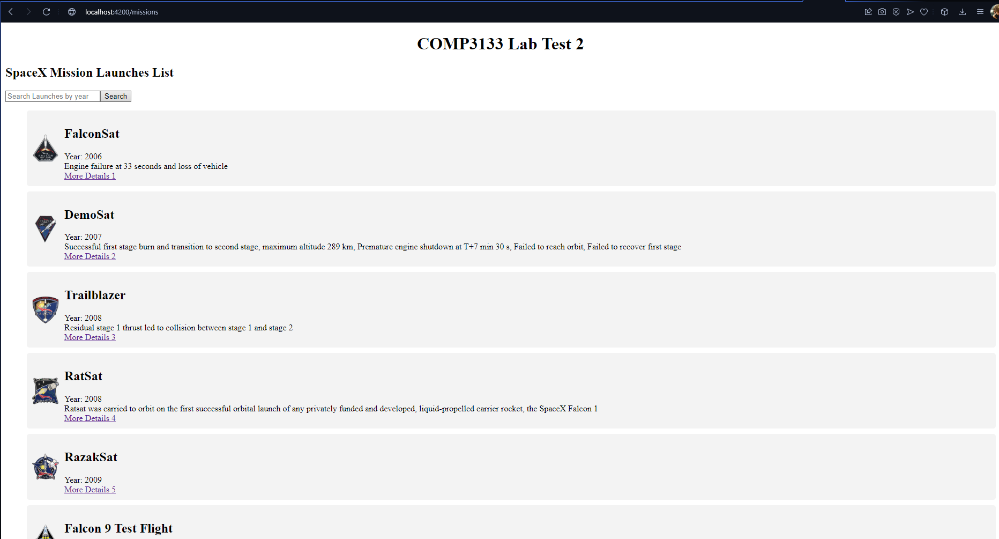
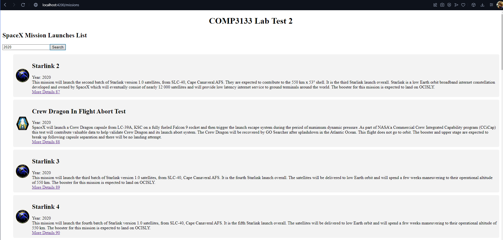
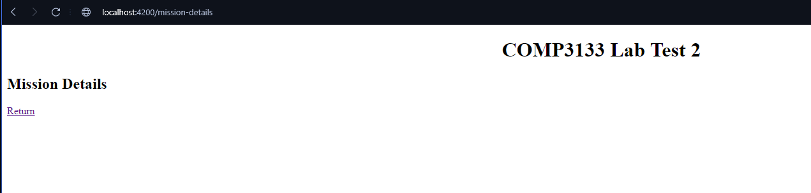

# Full Stack Development II Lab Test 2

## Dev Notes

Deployed on: https://101296633-lab-test2-comp-3133.vercel.app/missions

I was able to complete the missionlist component which asked for a rest API call and display a list with the asked fields

I also was able to create a filter feature which would only display launches of a specific year that the user inputs into the input field and submits

I was was trying to make it so each list item displayed on the mission list would carry over the flight_number field from its respective launch and I'd be able to display more fields for each object but it didn't work out.
I did however get the routes  to work when pressing on an anchor tag to take you to the mission details page

